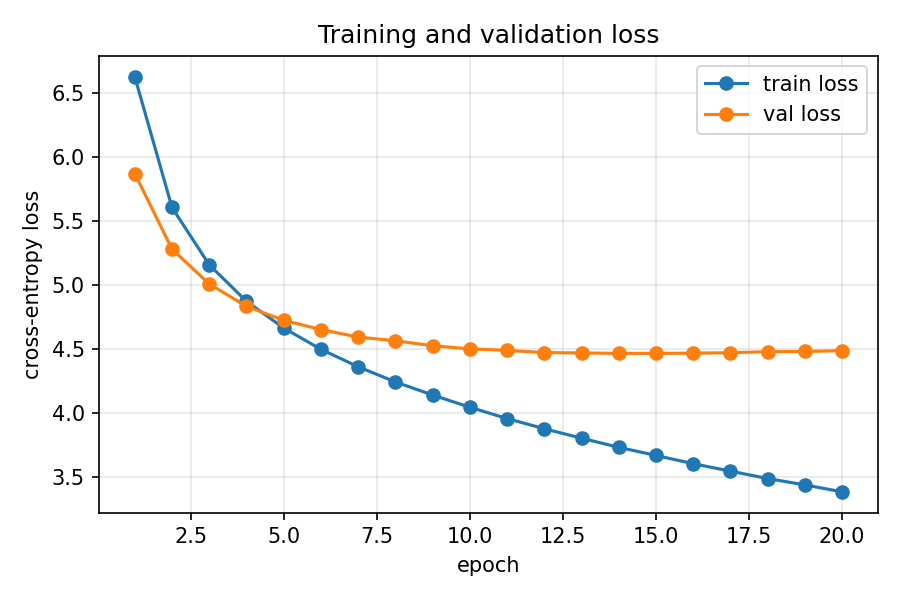

# Transformer Study

A from-scratch Transformer implementation including its underlying architecture, attention mechanisms, tokenizer (BPE), positional encoding, KV cache, LoRa for fintetuning and sampling strategies (top-k and top-p with temperature) and relevant unit testing for each of the features.

The model is an encoder–decoder Transformer trained on an English to Portuguese translation task with the `Helsinki-NLP/opus-100` dataset. 

## Repository layout

| File | Contents |
|---|---|
| `attention.py` | `Attention` (scaled dot-product with masking), `MultiHeadAttention` (fused Q/K/V projections, split into heads, merged back), `KV_Cache` |
| `ffn.py` | Position-wise feed-forward network (ReLU MLP) |
| `transformer.py` | Sinusoidal positional encoding, `TransformerBlock`, `Encoder`, `DecoderBlock`, `Decoder`, full `Transformer` |
| `training.py` | dataset/collate (pre-encoded once through BPE), mask construction, teacher-forcing shift, train/val loop with early stopping, checkpointing, plotting (entry point), shared seed-42 data split (`load_opus_splits`) |
| `generate.py` | Incremental generation (greedy / top-k / top-p) with KV cache + cached-vs-uncached benchmark |
| `evaluate.py` | Corpus BLEU-4 (sacrebleu) over the validation split — greedy-decodes the checkpoint on every val pair and writes `results/metrics.json` |
| `sampling.py` | Top-k and nucleus (top-p) sampling strategies with temperature |
| `lora.py` | LoRA low-rank adapter layers (`LoRA_Layer`, `LinearWithLoRA`) |
| `tokenizer.py` | From-scratch byte-level BPE built on the GPT-2 pre-tokenizer — merge training with incremental pair bookkeeping, `encode`/`decode`, checkpoint-serializable state (used by training and generation) |
| `tests/` | 70 pytest tests: masking invariants, KV-cache equivalence, sampling, LoRA, BPE tokenizer, training helpers, BLEU evaluation |
| `results/` | `history.json` (train/val curves) and `loss_curve.png` produced by `training.py` |
| `checkpoints/` | `best.pt` — best-validation checkpoint (model weights + config + tokenizer state) |

## Mechanisms implemented

- **Scaled dot-product attention** — scores scaled by `1/√d_k` to keep softmax out of saturation regions; arbitrary boolean masks applied via `-inf` fill.
- **Multi-head attention** — one fused Q/K/V projection per layer, reshaped into `num_heads` subspaces; outputs concatenated and projected back.
- **Three distinct masks** used jointly during training (`training.py:make_masks`):
  - *encoder padding mask* — the encoder never attends over `<pad>` tokens;
  - *causal (look-ahead) mask* — position `t` cannot attend to positions `> t`, preserving autoregressive decoding;
  - *cross-attention padding mask* — the decoder only attends to real encoder states.
- **Sinusoidal positional encoding** — fixed sin/cos encodings registered as a buffer, so they move with the model and its device.
- **Post-LayerNorm residual blocks** — `LayerNorm(x + Sublayer(x))` in the original paper's order.
- **KV cache** — during incremental decoding, keys/values from previous steps are cached so each new token only computes attention for itself. `Decoder.forward(start_pos=...)` gives each new token its true positional encoding instead of restarting at position 0. `Transformer.clear_cache()` resets the cache between sequences; it applies only to decoder self-attention, never cross-attention.
- **Decoding strategies** — greedy, top-k and top-p (nucleus) sampling, all with temperature support.
- **Teacher forcing with next-token shift** — `training.py:shift_targets` splits `[bos, w1, w2, eos]` into input `[bos, w1, w2]` and labels `[w1, w2, eos]`, so the model must actually predict the *next* token.
- **LoRA** — low-rank `A`/`B` adapters added on top of a frozen `nn.Linear`, initialized so the adapter contributes zero at the start of training.

## Design decisions

- **No softmax on the final head.** The model returns raw logits and `CrossEntropyLoss` performs log-softmax internally. If we were to change the loss for some other task, we would probably need to include softmax to the output of the decoder.
- **Special tokens occupy fixed ids** (`<pad>=0`, `<unk>=1`, `<bos>=2`, `<eos>=3`) because the BPE vocabulary is built specials-first, then the 256-byte alphabet, then the learned merges. This makes the `PAD_ID = 0` constant used for loss masking (`ignore_index`) and padding masks correct by construction, with an assertion guarding the invariant. `<unk>` is reserved but never produced by byte-level encoding.
- **Byte-level BPE tokenizer built from scratch** (`tokenizer.py`) — text is first split by the GPT-2 pre-tokenizer (regex pattern + byte-level mapping), then 4.000 merges are learned over the train split where only words touched by the last merge are rescanned. The base alphabet is the fixed 256 GPT-2 byte-to-unicode mappings, so **out-of-vocabulary is impossible**: `hello`, `Olá!` and `😀` all encode, with no hand-rolled lowercasing or punctuation stripping. Case is preserved (as in GPT-2 itself), so `Good morning` and `good morning` are different inputs.
- **Label smoothing (0.1)** keeps the model from driving the softmax towards one-hot targets it can rarely justify on 19k training pairs, which improves validation loss and calibration.
- **KV caching is opt-in** (`use_cache=False` everywhere by default). Training forward passes are full-sequence and must not accumulate cache state across batches; the cache is meant for incremental decoding, which must call `clear_cache()` between independent sequences.
- **Only decoder self-attention uses the cache.** Cross-attention reads the encoder output, which is identical on every decoding step, so caching it per step would duplicate keys/values instead of reusing them.
- **The decoder input and the labels are shifted by one position.** Feeding the same sequence as both would let the model copy the token it attends to (causal attention includes the diagonal), driving loss down without learning to generate — a bug caught by inspecting greedy outputs, now covered by `tests/test_training.py`.
- **Warmup + inverse-√ LR schedule and gradient clipping** (`clip_grad_norm_=1.0`) — the schedule from the original paper, implemented as a `LambdaLR`, keeps early updates small while LayerNorm statistics settle.

## Usage

```bash
pip install -r requirements.txt
python training.py        # train + save checkpoints/best.pt and results/
python evaluate.py        # greedy-decode the val split, score corpus BLEU-4
python -m pytest tests/ -q   # 70 tests
python tokenizer.py       # standalone BPE demo (4-sentence corpus)
```

`training.py` first learns a 4,000-merge byte-level BPE vocabulary on the train split (~95 s), then runs up to 20 epochs on a 20,000-pair opus-100 en→pt slice (19,000 train / 1,000 randomly held out for validation), with early stopping after 5 epochs without validation improvement, CUDA when available, and per-epoch train/val loss and validation perplexity printed. The model is d_model=256, 4 layers, 4 heads over the 4,260-token BPE vocabulary, trained with label smoothing, warmup + inverse-√ LR and gradient clipping. It saves the best-validation checkpoint (including the tokenizer state), `results/history.json`, and `results/loss_curve.png`.

Generation (loads the committed checkpoint, no training needed):

```bash
python generate.py --source "Good morning"                        # greedy
python generate.py --source "hello" --strategy topk --top-k 20 --temperature 0.8
python generate.py --source "hello" --strategy topp --top-p 0.9
python generate.py --benchmark                                     # KV-cache speed test
python evaluate.py --limit 50                                      # quick BLEU sanity check
```

Prompts are **case-sensitive** (GPT-2-style byte-level BPE has no case folding): `Good morning` is the form that appears at sentence starts in the training corpus, so it translates more reliably than `good morning`.

## Results

Training (seed 42, 19,000 train / 1,000 val pairs, d_model=256, 4 layers, 4 heads, 4,260-token byte-level BPE vocab):

| Epoch | Train loss | Val loss | Val perplexity |
|---|---|---|---|
| 1 | 6.63 | 5.87 | 355.4 |
| 5 | 4.67 | 4.73 | 112.8 |
| 10 | 4.05 | 4.50 | 90.2 |
| 15 (best) | 3.67 | 4.47 | 87.0 |
| 20 | 3.38 | 4.49 | 89.0 |

Early stopping kicked in at epoch 20 (5 without improvement); the checkpoint keeps the epoch-15 weights. Byte-level BPE also shrank the vocabulary from 19,401 to 4,260 tokens.

**Perplexity is only meaningful within one tokenizer.** The previous word-level run reported validation perplexity 227 vs 87 here, but perplexity is `exp` of the cross-entropy *per predicted token*, so it depends on token granularity and vocabulary size: predicting 4,260 BPE tokens that each cover several characters is a different — and mechanically easier — task than predicting 19,401 word tokens (word-level also maps rare words to `<unk>`, which byte-level BPE cannot). The 87 vs 227 gap therefore mixes a real modeling change with a change of measurement unit and should not be read as "half the error".

**BLEU on decoded text is the tokenizer-independent metric**: it is computed on the detokenized strings with sacrebleu's fixed 13a tokenization, so it depends only on translation quality, never on the model's vocabulary.

**Generation quality** (greedy decoding over all 1,000 validation pairs, epoch-15 checkpoint, `python evaluate.py`):

| Metric | Value |
|---|---|
| Corpus BLEU-4 | **5.68** |
| Signature | `nrefs:1\|case:mixed\|eff:no\|tok:13a\|smooth:exp\|version:2.6.0` |

BLEU 5.68 is low in absolute terms — expected for a 10.6M-parameter model trained on 19k pairs for 20 epochs — but it is a comparable number across future tokenizer or vocabulary changes, unlike perplexity.



**KV-cache benchmark** (CUDA GPU, 31 tokens, best of 3):

| Decode mode | Throughput |
|---|---|
| Uncached (full re-forward per token) | 268.3 tokens/s |
| Cached (incremental) | 275.0 tokens/s |
| **Speedup** | **1.03×** |

The gap is tiny because the model is small (10.6M params) and the 32-token window bounds the work per step — at this size most of the per-step cost is Python/host overhead, which caching does not remove. The benefit grows with sequence length, since cached decoding costs O(n) attention per token instead of O(n²) recomputation.

**Generation samples** — common in-corpus phrases translate correctly, including exact matches. Greedy decoding is deterministic; top-k/top-p sample from the predicted distribution, so outputs vary between runs:

```text
source : Hello, world.    strategy=greedy                →  Olá, mundo.    (deterministic)
source : Good morning     strategy=greedy                →  Bom dia.       (deterministic)
source : How are you?     strategy=greedy                →  Como estás?    (deterministic)
source : Help me!         strategy=greedy                →  Ajuda-me!      (deterministic, exact)
source : I love you       strategy=greedy                →  Amo-te         (deterministic)
source : hello world      strategy=greedy                →  Hanna          (bare prompt — the corpus only contains punctuated forms like `Hello, world.`)
```

Two honest limitations of a 19k-pair toy model: inputs outside the training distribution (`the cat sat on the mat`) degrade to fluent-looking nonsense, and prompts that differ in casing from the corpus (`good morning` vs `Good morning`) tokenize differently because byte-level BPE does not case-fold.

## Roadmap

- [x] Unit tests (masking invariants, KV-cache equivalence, shape checks) — 70 tests
- [x] Generation loop tying together KV cache + top-k/top-p sampling
- [x] Evaluation (perplexity within a run, corpus BLEU across tokenizers), checkpoints and loss-curve plots
- [x] Finish the BPE tokenizer study (`tokenizer.py`) — byte-level BPE used in training and generation
- [ ] CI with linting and tests

## References

- Vaswani et al., [Attention Is All You Need](https://arxiv.org/abs/1706.03762), 2017
- HF docs: [opus-100](https://huggingface.co/datasets/Helsinki-NLP/opus-100)
- Hu et al., [LoRA: Low-Rank Adaptation of Large Language Models](https://arxiv.org/abs/2106.09685), 2021
